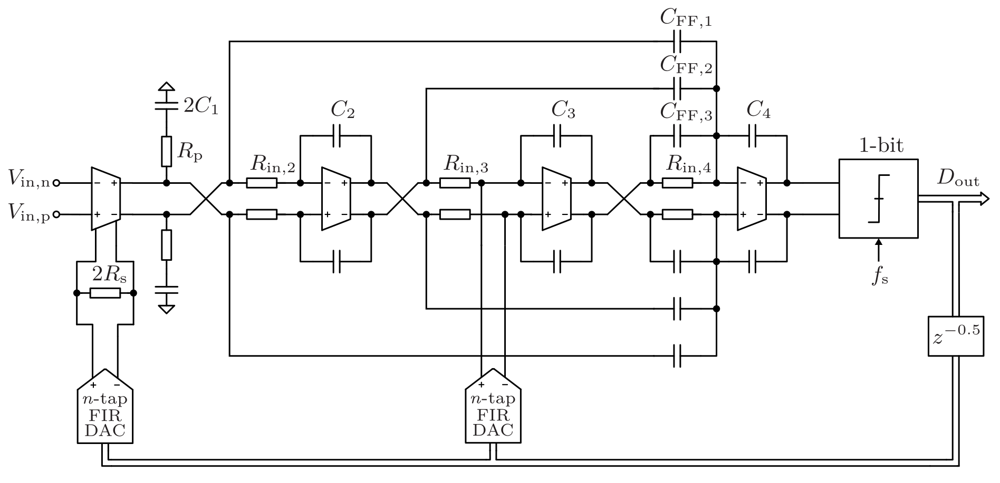
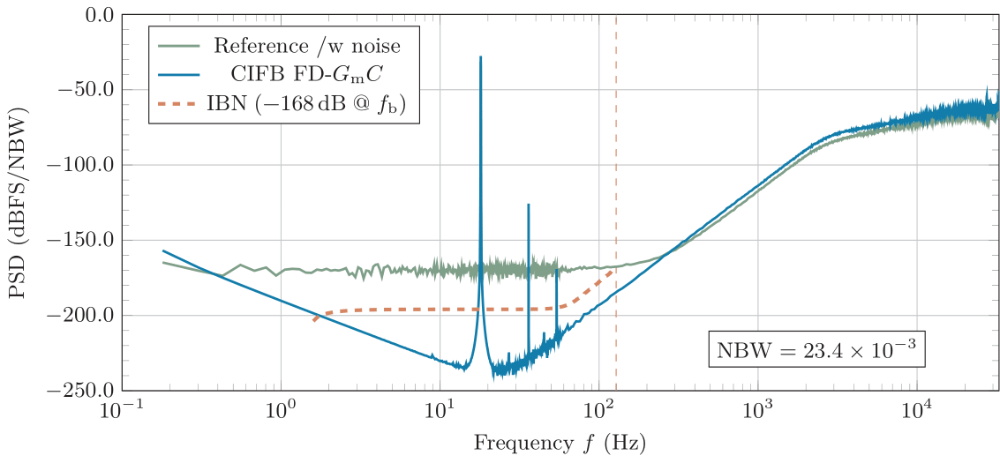
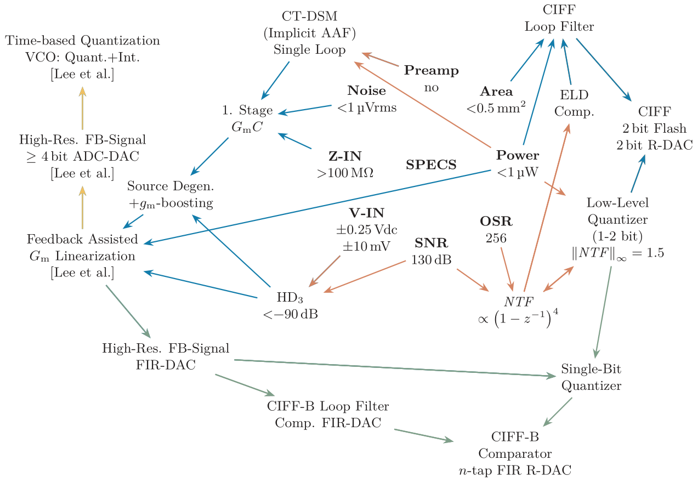

# A Case Study of an Ultra-Low-Power Delta-Sigma ADC for Biosignal Acquisition
Author: Michael Köfinger, 2023, Johannes Kepler University (JKU) Linz, Austria, Institute for Integrated Circuits (IIC).
This case study was performed in the context of a master thesis and will be published on the [JKU ePUB repository](https://epub.jku.at/nav/classification/111078).

# Abstract
This thesis performs a case study on an ultra-low-power (ULP) Delta-Sigma analog-to-digital converter (DS-ADC) for biosignal acquisition utilizing the Institute for
Integrated Circuits (IIC) Open-Source IC (OSIC) tools for the Skywater 130nm
(SKY130) process development kit (PDK). The system-level simulations were based on
Richard Schreier’s ∆Σ toolbox, and loop-filter non-idealities were separately modeled
in MATLAB based on the difference equations of a Delta-Sigma modulator (DSM).
The aim is to identify an alternative system to an existing implementation based on a
cascade of a pre-amplifier and a successive approximation register analog-to-digital
converter (SAR-ADC), see Fig. 1. The scope of this work was set on the DSM and the decimator
was omitted throughout most parts.
![Existing system, PRE-AMP [1] and SAR-ADC [2], and the alternative structure, a CT DS-ADC.](doc/fig/block_diag_all.png)

**Figure 1**: Existing system, PRE-AMP [1] and SAR-ADC [2], and the alternative structure, a CT DS-ADC. 

# System-Level Design
* Input-referred noise $<1~\mu\mathrm{V}_\mathrm{rms}$
* Input impedance $>100~\mathrm{M}\Omega$
* Input voltage range $\pm260~\mathrm{mV}_\mathrm{peak}$ $(\pm250~\mathrm{mV}_\mathrm{dc}\pm10~\mathrm{mV}_\mathrm{signal})$
* Power consumption $<1~\mu \mathrm{W}$
* Signal bandwidth of $128~\mathrm{Hz}$
* Max. oversampling ratio of $256$
* ADC resolution (LSB) $<0.2~\mu\mathrm{V}_\mathrm{pp}$
* Signal-to-Quantization-Noise-Ratio (SQNR) of $>140~\mathrm{dB}$
* Signal-to-Noise-Ratio (SNR) of $130~\mathrm{dB}$

The input-related specifications stem from the target application, which is biosignal acquisition. 
The rather slow signals have a large source impedance and are in the $\mu\mathrm{V}$ range. Furthermore, contact voltages at the electrode-skin interface must be handled appropriately, which leads to a large input voltage range. 
Since up to 1024 channels are required, the power consumption of a single channel is limited to only a fraction of the system's power budget. 
Lastly, the available system clock limits the max. oversampling ratio.

The fact that the DS-ADC should directly interface with the signal source, 
requires the implementation of a continuous-time (CT) DSM, due to its inherent anti-aliasing property.

Since circuit noise should dominate the noise floor, the SQNR was chosen $10~\mathrm{dB}$ larger than the target SNR. 
Given the fixed OSR and a simple flash quantizer, a 4th-order DSM is necessary, see Fig. 2.

**Figure 2**: High-level system design exploration. 

**Figure 3**: Block diagram of a DSM with feedback (blue) and feedforward coefficients (red). 

This 4th-order CT-DSM may be either implemented by a feedback (FB), or a feedforward (FF) structure. 
The block diagram, which depicts both structures is shown in Fig. 3. The corresponding state-space description is:

$\mathbf{ABCD}=\begin{bmatrix}
		\begin{array}{c|c}
			\mathbf{A} & \mathbf{B}\\
			\hline
			\mathbf{C} & \mathbf{D}
		\end{array}
	\end{bmatrix}=
	\begin{bmatrix}
		\begin{array}{cccc|cc}
			0 & 0 & 0 & 0 & b_{11} & b_{12}\\
			a_{21} & 0 & 0 & 0 & 0 & b_{22}\\
			0 & a_{32} & 0 & 0 & 0 & b_{32}\\
			0 & 0 & a_{43} & 0 & 0 & b_{42}\\
			\hline
			c_1 & c_2 & c_3 & c_4 & 0 & 0
		\end{array}
	\end{bmatrix}$

In the case of a FB modulator (blue coefficients), the ∆Σ toolbox gave the following set of coefficients:

$\mathbf{ABCD}_\textrm{FB}=
	\begin{bmatrix}
		\begin{array}{cccc|cc}
			0 & 0 & 0 & 0 & 0.00614 & -0.00614\\
			1 & 0 & 0 & 0 & 0 & -0.05550\\
			0 & 1 & 0 & 0 & 0 & -0.24946\\
			0 & 0 & 1 & 0 & 0 & -0.67129\\
			\hline
			0 & 0 & 0 & 1 & 0 & 0
		\end{array}
	\end{bmatrix}$

However, the output of the integrators $x_i$ (Fig. 3) must be scaled to fit within the supply voltage, as shown in Fig. 4. 

**Figure 4**: Internal states of the CIFB CT-DSM after dynamic range scaling, given an input tone with the maximum stable amplitude (MSA). 

However, the 2-bit output sequence $v(t)$ of the quantizer (see Fig. 3 and 4) must be observed in the frequency domain to evaluate the performance (SQNR) of the modulator, as shown in Fig. 5.

**Figure 5**: PSD of the output of the modulator $v(t)$.

# Front-End 
The most important result from system-level simulations is the need for a third-order distortion ratio $(\mathrm{HD}_3)$ of $<-90~\mathrm{dB}$.
Since no noise shaping is present at the first stage, the front-end transconductor must fulfill this requirement along with the noise, input voltage range and input impedance specifications from above. All these specifications lead to a source-degenerated differential pair with auxiliary amplifiers (Fig. 7) at both inputs, to increase the $g_\mathrm{m}$ of the transistors $M_1$, see Fig. 6. Since the power consumption is inherently linked with the linear input voltage range of this circuit, the so-called ''Feedback Assisted $G_\mathrm{m}$ Linearization'' proposed by [4] is a crucial part of this circuit. 
The concept of this technique is to facilitate the virtual ground nodes of the aux. amplifiers as summation points (current-domain) of the feedback signal. This allows to ideally cancel the signal current across the degeneration resistors $R_\mathrm{s}$. Consequently, the bias current $I_0$ may be reduced. 

**Figure 6**: Schematic of the frontend transconductor.

**Figure 7**: Schematic of the auxiliary amplifier of the frontend transconductor.

The 2-bit output $v(t)$ (Fig. 4) is too coarse for this technique. Therefore, the feedback signal is low-pass filtered with a digital filter (FIR), 
which leads to the use of so-called FIR-DACs. In addition to the feedback path in the first stage, 
another FIR-DAC is required to cancel the additional loop delay introduced by the low-pass filter.

# Top-Level Schematic
A thorough analysis in terms of several loop filter non-idealities was conducted and circuit-level design considerations in light of the findings were made. 
Overall, a FF loop filter is best suited in terms of noise budgets per stage, power and chip-area efficiency. 
The top-level schematic is given below in Fig. 8.

**Figure 8**: Top-level schematic of the proposed CT-DSM.

# Results
The main performance metrics of the implemented front-end transconductor are summarized along with system-level 
parameters and compared to two state-of-the-art neural recording ICs in Table 1.

**Table 1**: A comparison with state-of-the-art bidirectional neural recording ICs.

 |Parameter                            | THIS WORK | JSSC19 [3] | JSSC20 [4] |  
 |-------------------------------------|-----------|------------|------------|  
 | Architecture                        | CT-DSM    | CT-DSM    | CT-DSM    |
 | Input Type                          |$G_\mathrm{m}$|$G_\mathrm{m}$|$G_\mathrm{m}$|
 | BW $(\mathrm{kHz})$                 | $0.128$  |$0.2$     | $10$       |
 | Technology $(\mathrm{nm})$          | $130$    |$180$     | $110$      |
 | Open Source Technology              | yes      |no        | no      |
 | Supply $(\mathrm{V})$               | $1.8$    |$1.2$     | $1.0$   |
 | Input Signal Range $(\mathrm{mV}_\mathrm{pp})$|$\pm 300$ |$\pm 100$ | $\pm 150$|
 | Target SNR $(\mathrm{dB})$          | $130$        |$80$     | $80$         | 
 | OSR                                 | $256$       |$2048$     |$64$        | 
 | Quantizer Type                      |Flash    |Time-based     |Time-based       |
 | Quantizer Bits                      |$1$    |$5$     |$4$        |
 | Noise-Shaping Order                 |$4$    |$1$     |$2$      |
 | Total Input Noise $(\mu\mathrm{V}_\mathrm{rms})$  |$3.9$   |$1.3$     |$9.5$ |
 | Eq. Input Noise Density $^a$ $(\mathrm{V}/\sqrt{\mathrm{Hz}})$ |$345$|$92$| $95$ |  
 | Aux. Amp. W/L Input Pair $(\mu\mathrm{m}/\mu\mathrm{m})$    |$500/10$ |-|$250/1.6$  |
 | Aux. Amp. W/L Casc. CS $^b$ $(\mu\mathrm{m}/\mu\mathrm{m})$  |$40/80$ |-|$12/24$     |
 | Power Consumption Input $G_\mathrm{m}$ $(\mu\mathrm{W})$  |$8.8^c$ |$2.4$ |$4.2$       |

$^a$ Equivalent white noise spectral density based on parameters “BW” and “Total Input Noise”.

$^b$ Current source devices of the folded cascodes, $M_{11}$ and $M_{12}$ in Figure 8.

$^c$ Estimate based on 70% bias current reduction of the main transconductor (Feedback Assisted $G_\mathrm{m}$ Linearization).
The final value was doubled to take the CMFB circuit into account.

The main issue of the designed circuit is the large flicker noise coefficient of the SKY130 PDK. 
This may be counteracted by chopper stabilization or further increasing the area of $M_1$, $M_2$, $M_{11}$ and $M_{12}$ of the auxiliary amplifiers (Fig. 7). Although the area of $M_{11}$ and $M_{12}$ is already 11 times larger than the circuit implementation from [4]. 
Further increasing the area may degrade the performance in terms of the input impedance and stability of the first stage.

Furthermore, increasing the OSR to reduce the required order of noise shaping may also be beneficial in terms of the tight power budget, as shown by the comparison in Table 1.

Moreover, a mixed-signal/level simulation with ideal OTA macro models was performed in Ngspice, utilizing digital XSPICE blocks. 
This was used to verify the calculated circuit-level components based on the state-scaled prototype coefficients, see Fig. 9.

**Figure 8**: PSD of mixed-signal simulation using Ngspice.

# Summary
The following graph summarizes the complete design decisions of this master thesis. The most significant specification items in bold-font are the starting points.

1. Red: System level
2. Blue: Circuit level without improvement, coarse FB signal, conventional DSM
3. Green: Circuit level with proposed front-end, FIR-DAC, single-bit quantizer
4. Yellow: Circuit level alternative [4], high-level time-based quantizer

**Figure 9**: Summary of all major design decisions.

# Future Work
Due to the time limitation of this master thesis, several aspects could not be addressed in full detail:

* Excess loop delay compensation
* Simulation and implementation of the FIR-DACs
* Circuit design and layout of stages 2 to 4
* Circuit design and layout of the quantizer
* Further improvements and layout of the front-end transconductor
* Verification of the ''Feedback Assisted $G_\mathrm{m}$ Linearization'' technique [4]
* Implementation of the decimator

Moreover, the influence of a larger OSR, which would reduce the loop filter order, should be reassessed. However, the system clock was fixed in the context of this work, which required a 4th order CT-DSM.

# References
[1] S. Schmickl, T. Schumacher, P. Fath, T. Faseth and H. Pretl, "A 350-nW Low-Noise Amplifier With Reduced Flicker-Noise for Bio-Signal Acquisition," 2020 Austrochip Workshop on Microelectronics (Austrochip), Vienna, Austria, 2020, pp. 9-12, doi: 10.1109/Austrochip51129.2020.9232981.

[2] S. Schmickl, T. Faseth and H. Pretl, "An Untrimmed 14-bit Non-Binary SAR-ADC Using 0.37 fF-Capacitors in 180 nm for 1.1 µW at 4 kS/s," 2020 27th IEEE International Conference on Electronics, Circuits and Systems (ICECS), Glasgow, UK, 2020, pp. 1-4, doi: 10.1109/ICECS49266.2020.9294971.

[3] H. Jeon, J. -S. Bang, Y. Jung, I. Choi and M. Je, "A High DR, DC-Coupled, Time-Based Neural-Recording IC With Degeneration R-DAC for Bidirectional Neural Interface," in IEEE Journal of Solid-State Circuits, vol. 54, no. 10, pp. 2658-2670, Oct. 2019, doi: 10.1109/JSSC.2019.2930903.

[4] C. Lee et al., "A 6.5-μW 10-kHz BW 80.4-dB SNDR Gm-C-Based CT ∆∑ Modulator With a Feedback-Assisted Gm Linearization for Artifact-Tolerant Neural Recording," in IEEE Journal of Solid-State Circuits, vol. 55, no. 11, pp. 2889-2901, Nov. 2020, doi: 10.1109/JSSC.2020.3018478.
